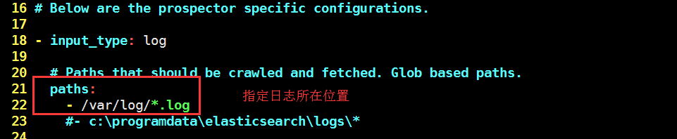
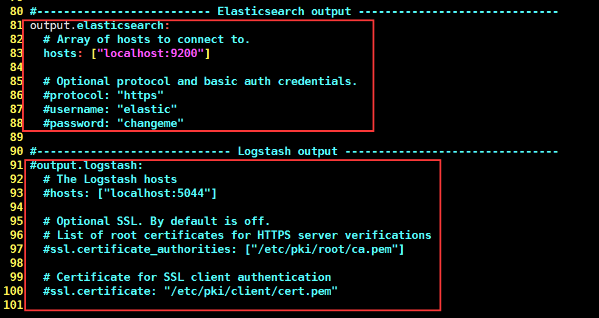

### ELK 在日常开发中的使用
#### 概述
```java
在日常开发中，监控是一个很重要的环节。除了日常的api监控心跳，我们可以从系统的日志中得到很多信息。
而ELK就称为一种很好的解决方案
```
#### ELK 介绍
```java
系统运维和开发人员可以通过日志了解服务器软硬件信息、检查配置过程中的错误及错误发生的原因。经常分析日志可以了解服务器的负荷，性能安全性，从而及时采取措施纠正错误。
包含三个部分：
    ELASTICSEARCH(是一个基于Lucene的开源分布式搜索服务器)
    LOGSTASH(是一个完全开源的工具，它可以对你的日志进行收集、过滤、分析，支持大量的数据获取方法，并将其存储供以后使用（如搜索）)
    KIBANA(是一个基于浏览器页面的Elasticsearch前端展示工具)
```

#### ELK 正常部署步骤
```java
1 filebeat将日志传到logstash
2 安装logstash 可以使用logstash分析日志，获取想要获取的内容。
3 logstash将获取的结果传入elastishsearch中。
4 可以与可视化技术结合展示得到的结果等。
```

#### ELK 在开发中的小缺点
```java
ELK 总得来说是非常优秀的结合了。但是在日常开发中不必搭建比较庞大的系统处理。而且在真实环境中，也几乎不允许在线上做大量的修改等。本次介绍的可以说是简化版的ELK。我们采用 Filebeat 将日志文件上传到elasticsearch，之后我们可以结合可视化等，从elasticsearch中查询出想要的结果。当然，这样虽然简单，也造成了另一个不便，filebeat需要你输出的结果是json数据，才能将结果传入elasticsarch中。但是这在真实开发的时候，这种代价是最小的。也是我个人觉得比较好的方式。我们可以很容易的使用一些日志框架，比如logback等打印一份需要的日志。
所以： 我们在真实开发的时候采用filebeat直接将日志传入到elastisearch中，这样既避免了在大流量情况下文件流传输造成的浪费。也很大减轻了出现错误的概率。
```
#### FILEBEAT安装使用
- 下载解压
```java
安装的时候可以根据自己的elasticsearch选择适配的版本
wget https://artifacts.elastic.co/downloads/beats/filebeat/filebeat-5.6.0-linux-x86_64.tar.gz
tar zxvf filebeat-5.6.0-linux-x86_64.tar.gz
```
- 修改配置文件

    - 修改日志文件位置
       
    - 修改elasticsearch配置(我们配置elasticsearch的信息。同时这个也可以使用logstash，不同点就是，直接传入elasticsearch中需要是json格式的日志。可以配置nginx，tomcat日志打印格式为json类型)
       
          
- 启动filebeat
    - ./filebeat start 
- 这样就会把日志中的内容全部输出到elasticsearch，进行的后继操作我们可以通过操作es来进行查询等操作。
    - 127.0.0.1:9200/_cat/indices?v 就能查看所有的索引数据  
  
    
#### ELK 总结
```java
    修改nginx或者tomcat的日志打印格式很容易，但是如果真的去修改业务代码的话，可能不是那么容易。如果我们只用tomat或者nginx打印想要的数据，既减少了流的传输影响，也很大程度的避免了一些线上不可知的错误。
```