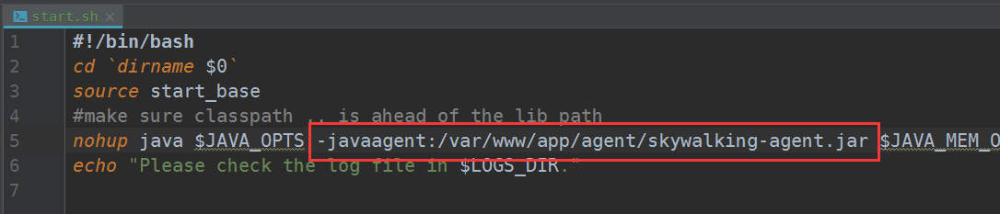
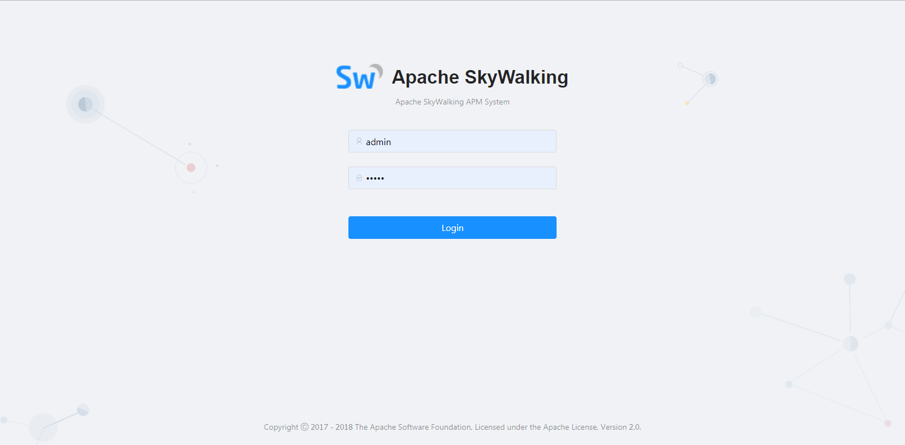

### incubator-skywalking

#### 介绍：
 - github
    - [文档地址](https://github.com/apache/incubator-skywalking/blob/5.x/docs/cn/Deploy-skywalking-agent-CN.md)
 - Apache下的一个apm监控工具
    - [介绍](https://github.com/apache/incubator-skywalking/blob/v5.0.0-GA/docs/README_ZH.md)
    - [下载](http://www.apache.org/dyn/closer.cgi/incubator/skywalking/5.0.0-GA/apache-skywalking-apm-incubating-5.0.0-GA.tar.gz)
 - 支持很多语言，这里只在java中引用
#### Java系统部署探针

```java

拷贝agent目录到所需位置. 日志，插件和配置都包含在包中,请不要改变目录结构。
增加JVM启动参数， -javaagent:/var/www/skywalking-agent/skywalking-agent.jar. 参数值为skywalking-agent.jar的绝对路径。 新的 agent package 目录结构如下：
   +-- skywalking-agent
       +-- activations
            apm-toolkit-log4j-1.x-activation.jar
            apm-toolkit-log4j-2.x-activation.jar
            apm-toolkit-logback-1.x-activation.jar
            ...
       +-- config
            agent.config  
       +-- plugins
            apm-dubbo-plugin.jar
            apm-feign-default-http-9.x.jar
            apm-httpClient-4.x-plugin.jar
            .....
       skywalking-agent.jar
* skywalking-agent/config/agent.config包含探针所需配置，中文说明如下。

   # The agent namespace
   # agent.namespace=default-namespace

   # 当前的应用编码，最终会显示在webui上。
   # 建议一个应用的多个实例，使用有相同的application_code。请使用英文
   agent.application_code=Your_ApplicationName（强烈建议使用域名加端口，80端口可忽略；如无域名，则使用自定义名称）

   # 每三秒采样的Trace数量
   # 默认为负数，代表在保证不超过内存Buffer区的前提下，采集所有的Trace
   agent.sample_n_per_3_secs=10（推荐每3秒采10个）

   # Authentication active is based on backend setting, see application.yml for more details.
   # agent.authentication = xxxx

   # 单个片段中span的最大数量值
   # 通过此配置项，skywalking可保证应用的内存是可控的
   agent.span_limit_per_segment=300

   # 设置需要忽略的请求地址
   # 默认配置如下
   agent.ignore_suffix=.jpg,.jpeg,.js,.css,.png,.bmp,.gif,.ico,.mp3,.mp4,.html,.svg

   # 探针调试开关，如果设置为true，探针会将所有操作字节码的类输出到/debugging目录下
   # skywalking团队可能在调试，需要此文件
   # agent.is_open_debugging_class = true

   # 对应Collector的config/application.yml配置文件中 agent_server/jetty/port 配置内容
   # 例如：
   # 单节点配置：SERVERS="127.0.0.1:8080" 
   # 集群配置：SERVERS="10.2.45.126:8080,10.2.45.127:7600" 
   collector.servers=apm.api:10800

   # 日志文件名称前缀
   logging.file_name=skywalking-agent.log

   # 日志文件最大大小
   # 如果超过此大小，则会生成新文件。
   # 默认为300M
   logging.max_file_size=314572800

   # 日志级别，默认为DEBUG。
   logging.level=INFO
```

#### agent 探针注意点

- Linux Tomcat 7, Tomcat 8 修改 tomcat/bin/catalina.sh,在首行加入如下信息.

```java
CATALINA_OPTS="$CATALINA_OPTS -javaagent:/path/to/skywalking-agent/skywalking-agent.jar"; export CATALINA_OPTS
```
- Windows Tomcat 7, Tomcat 8 修改 tomcat/bin/catalina.bat,在首行加入如下信息.

```java
  set "CATALINA_OPTS=-javaagent:/var/www/skywalking-agent/skywalking-agent.jar"
```
- JAR file 在启动你的应用程序的命令行中添加 -javaagent 参数. 并确保在-jar参数之前添加它. 例如:

```java
  java -javaagent:/var/www/skywalking-agent/skywalking-agent.jar -jar yourApplication.jar
```
#### 如果使用本项目结构
```java
可以使用agent-conf中的配置稍作修改，使用bin/start.sh 脚本配置使用
```

#### web ui
```java
默认使用的是8080端口，可以使用 http://ip:8080 端口进行访问。
默认使用的账号密码都是admin/admin 可以在webapp.yml中进行修改
```
